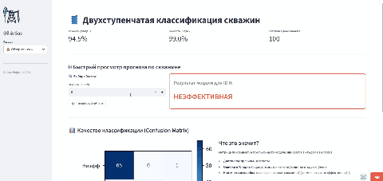
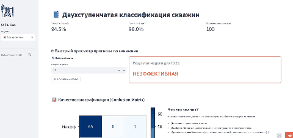
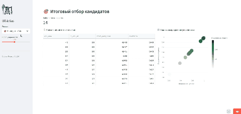
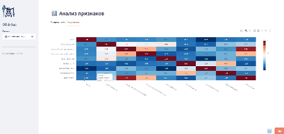

# 🛢️ **Система отбора скважин-кандидатов для технологии СПС**

<a href="https://ваш-адрес.streamlit.app/" style="text-decoration:none; color:inherit; vertical-align:middle;">
  <b> ← Нажмите, чтобы открыть интерактивный дашборд</b>
</a>

### 📄 **Аннотация проекта**

В проекте представлен метод автоматизированного отбора скважин для применения сшитых полимерных систем (СПС) на основе анализа данных трассерных исследований.

### **Проблема:** 

В условиях малого объема размеченных данных и высокой стоимости исследований, стандартные подходы машинного обучения часто дают низкую интерпретируемость. 

### **Решение:**

 Реализована двухэтапная модель классификации на базе CatBoost с глубокой интерпретацией через SHAP (SHapley Additive exPlanations).

 ---

## **Основные этапы реализации**

1. **Feature Engineering:** В основу модели легли 7 категорий параметров: от дебитов и обводненности до объемно-фильтрационных характеристик и скоростей фильтрации трассера.

* Имитирована экспертная логика через авторскую балльную систему (effect_score).
* Созданы синтетические категории по времени прорыва, массе вынесенного трассера и степени влияния нагнетательной скважины.

2. **Двухступенчатая классификация:**
   - **Stage 1 (Multiclass):** Первичный фильтр и выделение "спорных" случаев.
   - **Stage 2 (Binary):** Уточняющий прогноз для скважин из зоны неопределенности.

3. **Интерпретируемость (XAI):** Обоснование каждого прогноза с помощью SHAP Beeswarm plots.

---

## 💻 Интерфейс системы (Streamlit)
Прототип системы реализован в виде интерактивного дашборда для инженеров-разработчиков:

### 🏠 Обзор системы
Обеспечивает мгновенный скоринг скважины через ручной ввод ID или функцию случайного выбора объекта.
|  |
|:---:|

### 📊 Анализ данных (EDA)
Интерактивное исследование распределений параметров и корреляционной матрицы для оценки качества входных данных.
|  |
|:---:|

### 🧠 Интерпретация модели (SHAP)
Визуализация логики принятия решений моделью: глобальная значимость признаков и локальное объяснение по каждой скважине.
|  |
|:---:|

### 🎯 Отбор кандидатов
Формирование итогового ранжированного списка скважин-кандидатов с возможностью фильтрации по порогу уверенности модели.
|  |
|:---:|

---

## 🛠 Стек технологий
* **Core:** Python 3.11
* **ML:** CatBoost, Scikit-learn, SHAP
* **Visualization:** Plotly, Seaborn
* **Web-App:** Streamlit

## 📈 Результаты и выводы
- Реализованный подход позволяет снизить трудоемкость анализа трассерных испытаний и исключить субъективность экспертной оценки и снизить вероятность ошибок при выборе скважин-кандидатов.
- Система обеспечивает полную прозрачность (интерпретируемость) выводов для инженерного состава.

---

### Контакты
* **Автор:** Власов Никита
* **Роль:** ML Engineer
* **Статья:** Полный текст исследования доступен в репозитории (`article.pdf`)